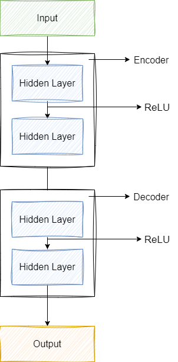
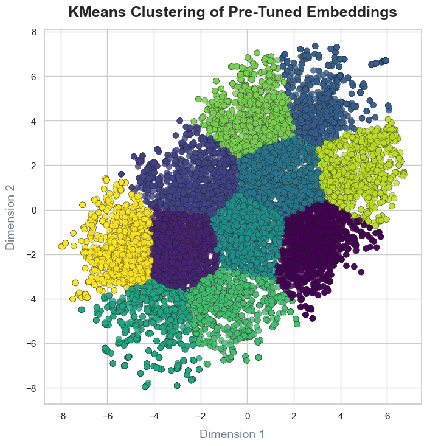
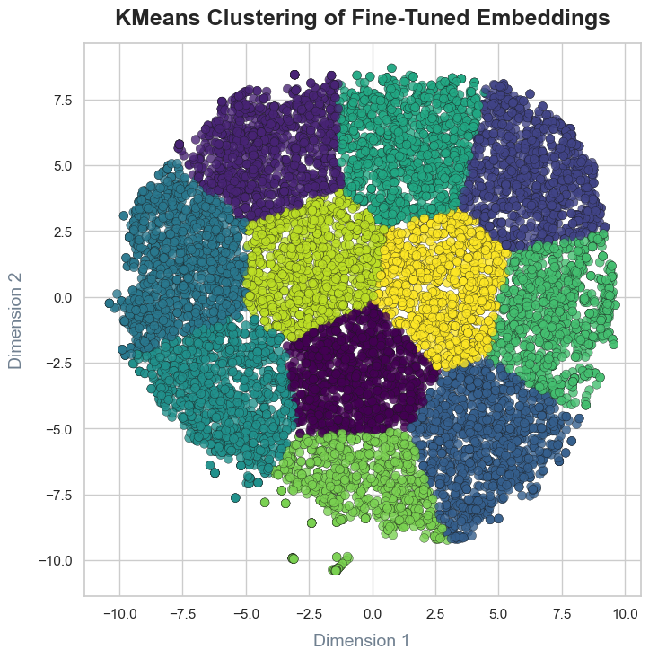
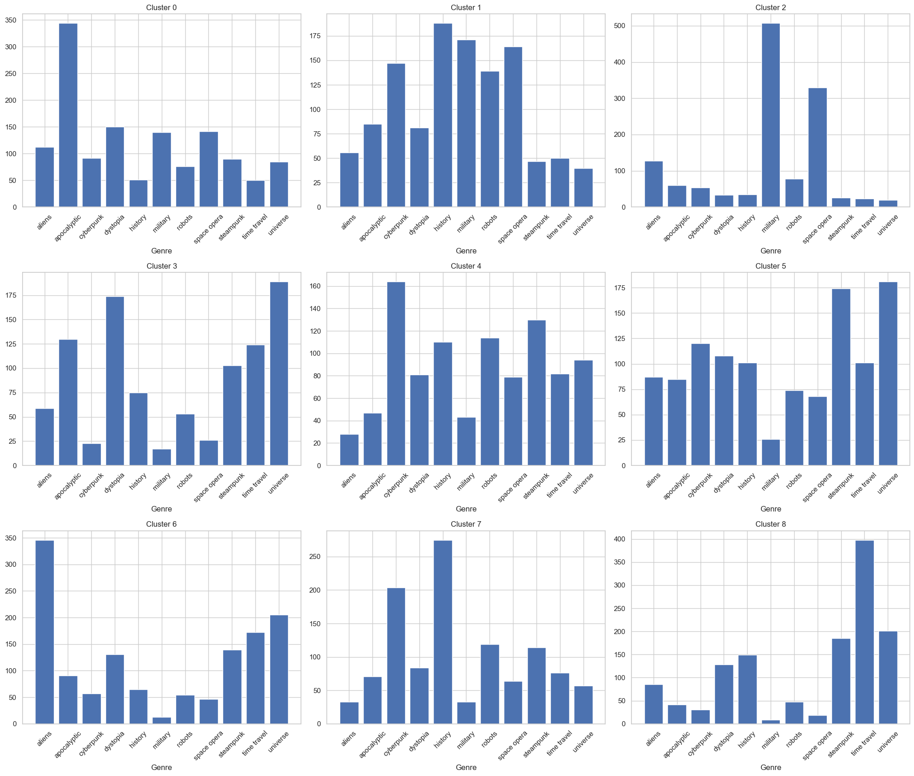

# APS2 - NLP - Vector-based Search

This project involves upgrading a previous TF-IDF-based document retrieval system to one that leverages NN embeddings, using semantic distances to compare documents and queries.

## Step 1: Find Embeddings

### 1. Dataset Description

The dataset was taken from a [Kaggle dataset](https://www.kaggle.com/datasets/tanguypledel/science-fiction-books-subgenres?resource=download) consisting of multiple CSV files, each representing a different science fiction subgenre. These include:

 - Aliens
 - Alternate History
 - Alternate Universe
- Apocalyptic
- Cyberpunk
- Dystopia
- Military
- Robots
- Space Opera
- Steampunk
- Time Travel
Each file contains book titles, descriptions, and ratings. The data has been preprocessed and combined into a single dataset used by the application.

### 2. Generating Embeddings

Embeddings for the book descriptions were created using the pre-trained model `paraphrase-MiniLM-L6-v2` from `SentenceTransformer`, designed for capturing sentence-level semantics. A fine-tuning process using a neural network autoencoder was applied to enhance these embeddings for our specific dataset.

### 3. Training Process

To adapt the embeddings to the dataset, an autoencoder was trained on the initial embeddings generated by the SentenceTransformer model. The autoencoder architecture is as follows:
- **Encoder**: Composed of two fully connected layers with ReLU activations, reducing the embedding dimensions from the initial size to a lower-dimensional latent space.
- **Decoder**: Reconstructs the original embeddings from the encoded representations.

<p align="center">
  
</p>

Mean Squared Error (MSE) was used as the loss function to minimize reconstruction error and retain the most relevant features. Training was conducted over 40 epochs with the Adam optimizer at a learning rate of 0.001.

**Equation for Loss**:
\[
\text{MSE Loss} = \frac{1}{n} \sum_{i=1}^{n} (\hat{y}_i - y_i)^2
\]

Here, \(\hat{y}_i\) are the reconstructed embeddings, and \(y_i\) are the original embeddings. Minimizing MSE allows the autoencoder to retain only the most essential features, effectively enhancing embedding quality for the task.

## Step 2: Visualize Embeddings

### 1. Pre-Tuning Embeddings Visualization

t-SNE was used to reduce the high-dimensional embeddings to 2D space for visualization. This allowed examination of any naturally occurring clusters among the genres. A scatter plot displays these clusters, colored according to k-means clustering with 11 clusters to match the genres in the dataset.

<p align="center">
  
</p>

**Figure**: t-SNE Scatter plot of pre-tuned embeddings, showing clusters.

### 2. Fine-Tuned Embeddings Visualization

After training the autoencoder, the t-SNE projection was repeated to visualize the refined embeddings. This helped assess whether the fine-tuning process better organized the embeddings by genre or other semantic features.

<p align="center">
  
</p>

**Figure**: t-SNE Scatter plot of fine-tuned embeddings, showing clusters.

In the visualization, it was observed:
- **Pre-tuning clusters** The first figure shows the pre-tuned embeddings, where the clusters are more blurred together. This overlap suggests that the pre-trained embeddings capture some semantic similarities, but they aren’t specialized enough to clearly separate the different categories in our dataset. 
- **Fine-tuned clusters** In the second figure, after fine-tuning, the clusters become noticeably clearer and more distinct. Each genre or category forms a tighter, more defined group. This means the fine-tuning process helped the model learn the specific features that set each category apart, making it much better at organizing our dataset by topic or theme.

### 3. Genre Distribution in Clusters

Each cluster was examined for genre distribution, with bar plots indicating the genre counts in each cluster. This analysis provides insight into whether the clustering aligns with genre distinctions or captures other semantic groupings.

<p align="center">
  
</p>

**Figure**: Bar plots of genre distributions within each cluster.

## Step 3: Test the Search System

### Query Tests

Following the previous APS-1 test cases, we implement three types of queries to assess the system:
1. **Query yielding fewer than 10 results**: ```"book that combines azimov and cathulu"```

| Book_Title  | Type  |Book_Description | Similarity |
|------------------------------------------|-----------|----------------------------------------------------------------------------------------------------------------------------------------------------------------------------------------|------------|
| Utopia                                   | robots    | Third in a powerful trilogy that examines Asimov's Three Laws of Robotics--a challenge welcomed and sanctioned by Isaac Asimov, and written with his cooperation.                                                                                                                                                                                                                                                                                                                                                                                                                                                                                                                                                                                        | 0.94426316 |
| Doom Patrol, Vol. 4: Musclebound         | robots    | A new chapter begins for the World's Strangest Heroes with MUSCLEBOUND, collecting issues #42-50 of the surreal series written by Grant Morrison. Revealing the secret origin of Flex Mentallo and the terrifying secret beneath the Pentagon, MUSCLEBOUND also features the subtle menace of the Beard Hunter and more!                                                                                                                                                                                                                                                                                                                                                                                       | 0.93342125 |
| The Ghost in the Shell: Global Neural Network | cyberpunk | "This historic collaboration with legendary creator Shirow Masamune based on the classic manga features four all-new stories in a beautiful full-color 160-page hardcover, by some of the world's most innovative comics writers and artists, plus a cover by the acclaimed Dustin Nguyen (Descender) and pinup illustration by Becky Cloonan. A covert mission in Shanghai reunites Kusanagi with a wartime rival amid shifting loyalties. The infiltration of an anti-cyberization cult calls for Section 9's most ""human"" members to do things the old-fashioned way. A deep dive into the mind of a criminal forces Kusanagi to question the nature of imagination - and her own identity. The stories in Global Neural Network bring a 21st-century perspective to its questions of human identity and the border between mind and machine that made The Ghost in the Shell one of the most revered manga of all time, and unleash top Western comics artists on eye-popping action scenes starring Kusanagi, Batou, Togusa, Aramaki, and all the members of Section 9! Original stories by: * Alex de Campi (Twisted Romance) & Giannis Milonogiannis (Prophet) * Brenden Fletcher (Gotham Academy, Motor Crush) & LRNZ (Golem) * Max Gladstone (the Craft Sequence) & David López (All-New Wolverine) * Genevieve Valentine (Mechanique, Icon), & Brent Schoovoner (The Astonishing Ant-Man)" | 0.9301174  |


2. **Query yielding 10 results**: ```"a history about the dangers of AI"```

| Book_Title                                   | Type                  | Book_Description                                                                                                                                                                                                                       | Similarity |
|----------------------------------------------|-----------------------|---------------------------------------------------------------------------------------------------------------------------------------------------------------------------------------------------------------------------------------|------------|
| Cryptonomicon                                | history, cyberpunk    | Cryptonomicon spans WWII and the present, following codebreakers and modern-day tech enthusiasts, dealing with cryptography, hidden gold, and complex conspiracies.                                                                   | 0.94220704 |
| Beyond Human: Living with Robots and Cyborgs | robots                | Explores the integration of robots and cyborg parts into daily life, discussing future enhancements to the human body and societal implications.                                                                                      | 0.9419511  |
| Machine Man by Kirby & Ditko                 | robots                | Chronicles the story of X-51, a robot with human traits, pursued by the military. Illustrated by comic legends Jack Kirby and Steve Ditko.                                                                                            | 0.93833923 |
| Pandemic                                     | apocalyptic           | Humanity faces a devastating engineered disease in this thrilling finale to a trilogy about alien invasions and global survival.                                                                                                      | 0.9373434  |
| Exit 9                                       | apocalyptic           | In this intense sequel, Project Eden’s virus threatens humanity, with a small resistance group as the only hope against a plan decades in the making.                                           | 0.9368633  |
| The Preserve                                 | robots                | A murder mystery set in a future where robots dominate and humans live in isolated preserves, exploring tensions between human and AI societies.                                                | 0.9363986  |
| T2: Rising Storm                             | robots                | Sarah and John Connor fight to prevent Judgment Day, facing Infiltrators and a military threat in their quest to save humanity from machine dominance.                                         | 0.9359685  |
| Opening Moves                                | cyberpunk             | Alan, a college student, dives into a virtual reality game introduced by an alien civilization, only to realize the stakes are higher than he imagined.                                         | 0.9347961  |
| The Surrogates                               | cyberpunk             | Set in 2054, personal android surrogates allow people to live through machines, raising questions about identity and the impact of technology on society.                                       | 0.93472093 |
| Descender, Vol. 4: Orbital Mechanics         | space opera, robots   | Tim-21 and his allies embark on a quest in a galaxy filled with conflict, as they search for a robot key to the mysterious Harvesters in this sci-fi epic.                                     | 0.93454766 |

3. **Non-obvious query**: ```"In a galaxy far far away"```

| Book_Title             | Type                          | Book_Description                                                                                                                                                                         | Similarity |
|------------------------|-------------------------------|-------------------------------------------------------------------------------------------------------------------------------------------------------------------------------------------|------------|
| Invasion               | aliens, apocalyptic           | Alien spheres approach Earth, sparking panic and chaos. Meyer Dempsey prepares his family to escape to a safe haven in Colorado before society collapses.                                 | 0.96364397 |
| The Dreaming Void      | space opera, cyberpunk        | In 3589, the Void threatens the galaxy. Dreams within the Void spark a cult, leading to a dangerous pilgrimage that could accelerate universal destruction.                               | 0.95539916 |
| Aftermath              | apocalyptic                   | In 2026, a supernova causes global devastation. Survivors face floods, disease, and societal collapse while attempting to adapt to the new, hostile environment.                         | 0.9550126  |
| Spacehounds of IPC     | space opera                   | After an attack, survivors of a space liner crash on Ganymede, where they must face primitive threats, build a new spacecraft, and contend with Jovian intelligences.                    | 0.9514819  |
| Planet Strike          | military                      | Ancient aliens threaten to invade through a portal. Creed leads a mission to close the rip between universes, facing impossible odds in a deadly alien battleground.                    | 0.95053226 |
| Edges                  | space opera                   | A crew of explorers on a mission to uncover the cause of human civilization's collapse encounter peril and mystery on the edge of human expansion.                                       | 0.9504517  |
| The Daedalus Incident  | history, steampunk            | On Mars, quakes hint at a greater mystery, as a 300-year-old journal ties the events to an 18th-century naval officer battling mystic forces across the Void between worlds.             | 0.94933164 |
| House of Reeds         | history                       | Imperial Méxica xenoarcheologist Gretchen Anderssen navigates dangerous imperial politics on a distant planet, facing warfare as she investigates an ancient artifact.                    | 0.94908524 |
| Seveneves              | dystopia, apocalyptic, robots | After Earth faces extinction, a plan to preserve humanity in space unfolds, leading to a journey into an alien world five thousand years later.                                          | 0.94827616 |
| Watching the Clock     | time travel                   | Federation temporal agents manage timestream chaos, preventing future-altering events from disrupting history in the Temporal Cold War.                                                 | 0.9479713  |


**Further Improvements and Observations**:
- Future steps could explore alternative similarity measures, such as KL-Divergence, to optimize retrieval precision.

